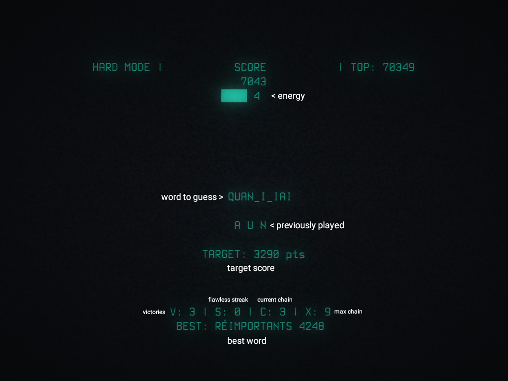

## SUPER HANGMAN LEGEND

## SYNOPSIS

`hangman` [**OPTIONS**]

## DESCRIPTION

**Hangman** is an arcade game where you have to guess a random word.

Best played with **cool-retro-term**

## DEPENDENCIES

bash, coreutils, libpulse, ncurses, words.

## INSTALL/UNINSTALL

Clone this repository and,

Install: `make install`

Uninstall: `make uninstall`

## USAGE

`hangman` [splash] [easy | hard] [rank] 

## OPTIONS

  * **splash**

    Show a splash screen.

  * **easy**
    
    Select easy mode.

  * **hard**

    Select hard mode.

  * **rank**

    Display score board.

## RULES

Guess a random word by entering letters and try to get as much points as possible. 
You start the game with 10 **energy** points. For each incorrect letter, you lose 1 **energy** point. 
You lose the game when **energy** reaches 0. 
If you enter 3 correct letters in a row, game enters **chain** mode so that next correct letters grant extra points. 
Already visible letters can also be played to get more points or to initiate **chain** mode. 

If you guess a word flawlessly, you get bonus points. 
If you get 3 or more flawless victories in a row, you also get bonus points.

## GAME SCREEN

## ENERGY

In **easy** mode you get 1 **energy** point for each correct letter entered when in **chain** mode.

In **normal** and **hard** mode you get 1 **energy** point every 2 victories.

In **normal** mode, **energy** is fully refilled every 6 victories.

In **hard** mode, **energy** is fully refilled every 10 victories.

## POINTS

victory:

  - letters x energy

chain:

  - easy: chain x 50
  - normal: chain x 100
  - hard: chain x 150

flawless:

  - easy: 250
  - normal: 500
  - hard: 1000

streak:

  - easy: streak x 500
  - normal: streak x 2500
  - hard:  streak x 5000
